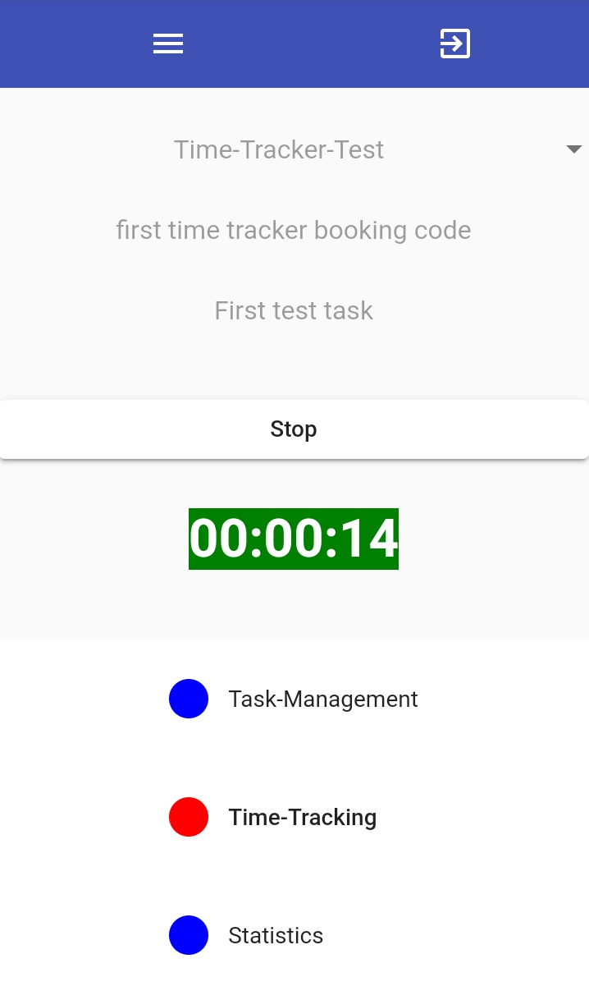

# Time-Tracker

## About
A time-tracker as [Angular web-application](https://github.com/JensUngerer/time-tracker-client) with a [Nodejs backend](https://github.com/JensUngerer/tt-server).



In the following section [Compile and Setup](#Compile-and-Setup), it is described how to download all code in one step, plus how to setup the environment for running it.

**The mongodb collections and the authentification currently only support one user: so no multi user support, yet.**

### Features

* Start-Stop entries (with time stamps)
* Summarized Start-Stop entries (between two moment in times)
* Configurable to link to different web application (via the [config.json in client folder](https://github.com/JensUngerer/time-tracker-client/blob/master/src/assets/config/config.json)) 
* ...

## Compile and Setup
The following described is intended for a Linux - system (e.g. on on a virutal private server (VPS)).

### Cloning and checkout of sub-modules

```bash
git clone --recurse-submodules --remote-submodules https://github.com/JensUngerer/time-tracker.git tt
cd tt
cd ./client
git checkout master
cd ..
cd ./common
git checkout master
cd ..
cd ./documentation
git checkout master
cd ..
cd ./server
git checkout master
```

### MongoDB setup

Install [MongoDB](https://docs.mongodb.com/manual/tutorial/install-mongodb-on-debian/).

Please, adjust the ``/etc/mongod.conf``, so that it runs on port ``27021``:

```config
# network interfaces
net:
  port: 27021
  bindIp: 127.0.0.1
```

In order to see this change in the ``mongod.conf``, please restart ``mongod``:
``systemctl stop monogd`` and ``systemctl stop mongod``.

### Create database collections (Mongodb must be installed and running)

```bash
cd tt
cd database
createDatabase.sh
```

### Install dependencies

```bash
cd tt
cd ./client
npm i
cd ..
cd ./server
npm i
cd ..
cd ./common
npm i
```

### Adding one user
```bash
cd tt
cd user-management
touch .env
```

```config
DATA_BASE_STRING=mongodb://localhost:27021
DATA_BASE_NAME=express-session
```

```bash
npm i
npm run build:ci
npm run start:ci
```

### Configure your domain
* client
  * [httpBaseUrl](https://github.com/JensUngerer/time-tracker-client/blob/master/src/environments/environment.prod.ts)
  * [index.prod.html](https://github.com/JensUngerer/time-tracker-client/blob/master/src/index.prod.html)
* server
  * [.env](https://github.com/JensUngerer/tt-server/blob/master/.env)

### Configure your ssl certificate

* server
  * create ``server/certs`` folder
  * insert ``*.key`` and ``*.cer`` in ``server/certs`` folder 
  * edit their names in [.env](https://github.com/JensUngerer/tt-server/blob/master/.env)

## Deployment (as a Linux service)

### Building

```bash
cd tt
cd ./client
ng build --prod=true
cd ./..
cd ./server
npm run build:prod-linux
```

### Copying

```bash
mkdir /var/www/timeTracker
mkdir /var/www/timeTracker/server
cd tt
cd server
cp -r ./dist /var/www/timeTracker/server
chmod u+x /var/www/timeTracker/server/dist/tt-server.js
cp .env /var/www/timeTracker/server/
touch /var/log/time-tracker/timeTracker.log
```

```bash
mkdir /var/www/timeTracker/client
cd tt
cd client
cp -r ./dist/ /var/www/timeTracker/client
```

### Setup Linux background service
Compare the corresponding [Stackoverflow article](https://stackoverflow.com/questions/4018154/how-do-i-run-a-node-js-app-as-a-background-service).

```bash
touch /etc/systemd/system/timeTracker.service
```

```config
[Unit]
Description=TheTimeTrackerServer

[Service]
ExecStart=/var/www/timeTracker/server/dist/tt-server.js
Restart=always
User=nobody
# Note Debian/Ubuntu uses 'nogroup', RHEL/Fedora uses 'nobody'
Group=nogroup
Environment=PATH=/usr/bin:/usr/local/bin
Environment=NODE_ENV=production
WorkingDirectory=/var/www/timeTracker/server

[Install]
WantedBy=multi-user.target
```

### Setup nginx
```bash
touch /etc/nginx/sites-available/tt-http-reverse-proxy
```

```config
server {
    listen  80;
    ssl_certificate  /var/www/timeTracker/server/certs/your-cer.cer;
    ssl_certificate_key  /var/www/timeTracker/server/certs/your-key.key;
    server_name  _;
    access_log  /var/log/nginx/timeTracker-http.log;
    charset  utf-8;

    location / {
        proxy_pass  https://first.second.third.fourth:3021;
    }
}
```

```bash
ln -s /etc/nginx/sites-available/tt-http-reverse-proxy /etc/nginx/sites-enabled/tt-http-reverse-proxy
```

```bash
touch /etc/nginx/sites-enabled/tt-reverse-proxy
```

```config
server {
    listen  443 ssl;
    ssl_certificate /var/www/timeTracker/server/certs/your-cer.cer;
    ssl_certificate_key  /var/www/timeTracker/server/your-key.key;
    server_name  _;
    access_log  /var/log/nginx/timeTracker-https.log;
    charset  utf-8;

    location / {
        proxy_pass  https://first.second.third.fourth:3021;
    }
}
```

```bash
ln -s /etc/nginx/sites-available/tt-reverse-proxy /etc/nginx/sites-enabled/tt-reverse-proxy
```

### Restart nginx
```bash
systemctl stop nginx
```

```bash
systemctl start nginx
```

### Starting the Time-Tracker application 
```bash
systemctl start timeTracker
```